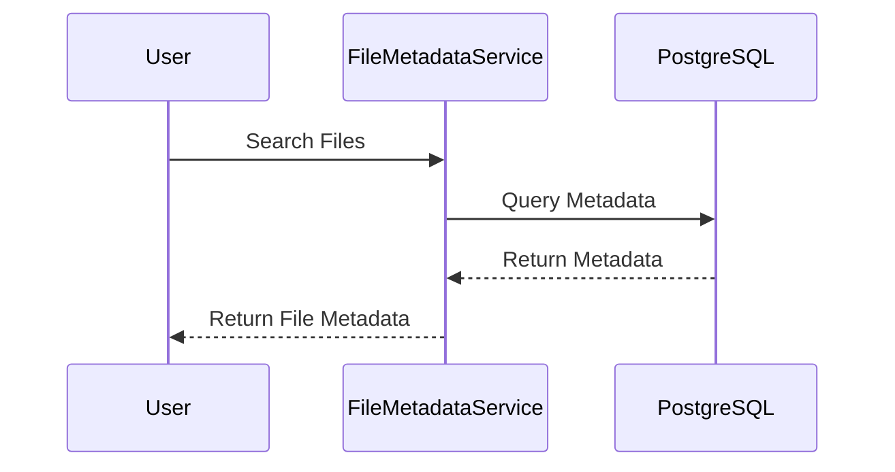

# FileManager

## Task description

Write a Java application that allows files to be uploaded and retrieved via an API.  
A frontend is not required, only the API. 
The request to retrieve the list of uploaded files should be parameterizable: 
it should be possible to get a list of files of a specific type, larger/smaller/equal to a certain size.

**Additional requirements**

- File uploads should be handled by one service.
- File analysis (type, size) should be processed by another service.
- The analysis results should be stored in a PostgreSQL database.
- The files themselves should be stored in S3 (MinIO).
- Use Hibernate for interacting with PostgreSQL.
- Use Eureka for service discovery.

## Table of Contents

1. [Project Structure](#project-structure)
2. [Architecture](#architecture)
3. [Features](#features)
4. [Prerequisites](#prerequisites)
5. [Installation](#installation)
    - [Clone the repository](#clone-the-repository)
    - [Set up MinIO](#set-up-minio)
    - [Set up PostgreSQL](#set-up-postgresql)
6. [Build the Project](#build-the-project)
7. [How to Use](#how-to-use)
   - [Swagger UI](#swagger-ui)
   - [Upload a File](#upload-a-file)
   - [Get list of uploaded files](#get-list-of-uploaded-files)
   - [Example Requests](#example-requests)
8. [Configuration Parameters](#configuration-parameters)
    - [FileMetadataService Configuration](#filemetadataservice-configuration)
    - [FileUploadService Configuration](#fileuploadservice-configuration)
    - [Managing Configuration Parameters](#managing-configuration-parameters)

## Project Structure

- **Eureka Server**: Service registry for the microservices.
- **FileMetadataService**: Manages metadata for files.
- **FileUploadService**: Handles file uploads. Responsible for all interactions with the user.

## Architecture

The project consists of two main microservices and Eureka Server,
each responsible for a specific part of the file management process:

1. **FileUploadService**
   - Receives files from the user and uploads them to MinIO.
   - If there is more than one file, they are processed sequentially. The maximum number of files in one upload 
     request is controlled by the parameter `file.max.upload.count`.
   - Sends an HTTP message to FileMetadataService with a JSON containing the link to the file in MinIO. It discovers the FileMetadataService through Eureka.
   - If the file is successfully uploaded and processed, it returns a 200 status and a success message to the user.
   - If the connection to FileMetadataService fails, it retries up to three times. If it still fails, it deletes the file from MinIO and returns an error to the user. It also sends a request to FileMetadataService to remove the file from the database if it was already registered.
   - If the file is invalid or too large, it returns an error to the user. The file size limit is controlled by the parameter `file.max-size`.

2. **FileMetadataService**
   - Accepts a JSON with a link to the file, retrieves the necessary metadata, and records it in the PostgreSQL database along with the file link.
   - Returns an error to FileUploadService if mandatory metadata is missing.
   - Provides an API to return a list of uploaded files in JSON format. Supports filtering files by size (greater than, less than, equal to, with optional size units such as bytes, KB, MB, GB) and by type.
   - Implements validation to ensure non-conflicting filter conditions, such as ensuring `min_size` is not greater than `max_size`.

### Sequence diagrams

#### File Upload with Success

   ```mermaid
   sequenceDiagram
       participant User
       participant FileUploadService
       participant MinIO
       participant Eureka
       participant FileMetadataService
       participant PostgreSQL
   
       User ->> FileUploadService: Upload File
       FileUploadService ->> MinIO: Store File
       alt MinIO upload failure
           MinIO -->> FileUploadService: Error Response
           FileUploadService -->> User: Error Response
       else MinIO upload success
           MinIO -->> FileUploadService: File Stored
           FileUploadService ->> Eureka: Discover FileMetadataService
           FileUploadService ->> FileMetadataService: Send File Link
           FileMetadataService ->> MinIO: Retrieve File Metadata
           MinIO -->> FileMetadataService: File Metadata
           FileMetadataService ->> PostgreSQL: Check if Metadata Exists
           alt Metadata Exists
               FileMetadataService ->> PostgreSQL: Update Metadata
               PostgreSQL -->> FileMetadataService: Metadata Updated
           else Metadata Does Not Exist
               FileMetadataService ->> PostgreSQL: Store Metadata
               PostgreSQL -->> FileMetadataService: Metadata Stored
           end
           FileMetadataService -->> FileUploadService: Metadata Stored
           FileUploadService -->> User: Success Response (200)
       end

   ```

#### File Upload with Failures

1. MinIO upload failure

   ```mermaid
   sequenceDiagram
       participant User
       participant FileUploadService
       participant MinIO
   
       User ->> FileUploadService: Upload File
       FileUploadService ->> MinIO: Store File
       MinIO -->> FileUploadService: Error Response
       FileUploadService -->> User: Error Response
   ```

2. File Upload with FileMetadataService 400 Error

   ```mermaid
   sequenceDiagram
       participant User
       participant FileUploadService
       participant MinIO
       participant Eureka
       participant FileMetadataService
       participant PostgreSQL
   
       User ->> FileUploadService: Upload File
       FileUploadService ->> MinIO: Store File
       MinIO -->> FileUploadService: File Stored
       FileUploadService ->> Eureka: Discover FileMetadataService
       FileUploadService ->> FileMetadataService: Send File Link
       FileMetadataService -->> FileUploadService: Error Response (400)
       FileUploadService ->> MinIO: Delete File
       FileUploadService ->> FileMetadataService: Request to Delete File Metadata
       FileMetadataService ->> PostgreSQL: Delete File Metadata
       PostgreSQL -->> FileMetadataService: Acknowledgement
       FileMetadataService -->> FileUploadService: Acknowledgement
       FileUploadService -->> User: Error Response
   ```

3. File Upload with FileMetadataService 500 Error

   ```mermaid
   sequenceDiagram
    participant User
    participant FileUploadService
    participant MinIO
    participant Eureka
    participant FileMetadataService
    participant PostgreSQL

    User ->> FileUploadService: Upload File
    FileUploadService ->> MinIO: Store File
    MinIO -->> FileUploadService: File Stored
    FileUploadService ->> Eureka: Discover FileMetadataService
    FileUploadService ->> FileMetadataService: Send File Link
    FileMetadataService -->> FileUploadService: Error Response (500)
    alt Retry Up to 3 Times
        FileUploadService ->> FileMetadataService: Send File Link
        FileMetadataService -->> FileUploadService: Error Response (500)
    end
    FileUploadService ->> MinIO: Delete File
    FileUploadService ->> FileMetadataService: Request to Delete File Metadata
    FileMetadataService ->> PostgreSQL: Delete File Metadata
    PostgreSQL -->> FileMetadataService: Acknowledgement
    FileMetadataService -->> FileUploadService: Acknowledgement
    FileUploadService -->> User: Error Response
   ```

#### Get File Metadata



#### Get File Metadata with failures

1. Get File Metadata with Invalid Parameters

   ```mermaid
   sequenceDiagram
    participant User
    participant FileUploadService
    participant Eureka
    participant FileMetadataService

    User ->> FileUploadService: Search Files
    FileUploadService ->> Eureka: Discover FileMetadataService
    FileUploadService ->> FileMetadataService: Search Files
    FileMetadataService -->> FileUploadService: Error Response (400)
    FileUploadService -->> User: Error Response (400)
   ```
2. Get File Metadata with Database Failures
```mermaid
   sequenceDiagram
    participant User
    participant FileUploadService
    participant Eureka
    participant FileMetadataService
    participant PostgreSQL

    User ->> FileUploadService: Search Files
    FileUploadService ->> Eureka: Discover FileMetadataService
    FileUploadService ->> FileMetadataService: Search Files
    FileMetadataService ->> PostgreSQL: Query Files
    alt Response 500 or No Response from PostgreSQL
        PostgreSQL -->> FileMetadataService: Error Response (500) or No Response
        alt Retry Up to 3 Times
            FileMetadataService ->> PostgreSQL: Retry Query Files
            PostgreSQL -->> FileMetadataService: Error Response (500) or No Response
        end
        FileMetadataService -->> FileUploadService: Error Response (500)
        FileUploadService -->> User: Error Response (500)
    else Success Response
        PostgreSQL -->> FileMetadataService: Files Found
        FileMetadataService -->> FileUploadService: Files Found
        FileUploadService -->> User: Files Found Response
    end
   ```


## Features

1. **Authentication in FileUploadService**
   - Uses basic authentication with the username `any` and password `logic`.
   - All user requests are password-protected, with a single user group.

2. **Versioning**
   - If a file with the same name already exists, it is overwritten in MinIO.
   - FileMetadataService updates the metadata in its `file_metadata` table.

3. **Resilience to Communication Failures**
   - After successfully uploading a file to MinIO, FileUploadService sends the link to FileMetadataService. If the second service does not respond (due to a timeout) or returns a 500 error, it retries up to three times (controlled by the `send.message.retry` parameter). If a 400 error is returned, it retries once. If it still fails, FileUploadService deletes the file from MinIO and sends a request to FileMetadataService to delete the file metadata if it was registered.


## Prerequisites

- Java 17
- Gradle
- MinIO (can be run locally or using Docker)
- PostgreSQL (can be run locally or using Docker)

## Installation

### Clone the repository

```sh
git clone https://github.com/leanor13/FileManager.git
cd FileManager
```

### Set up MinIO
MinIO is a high-performance, S3-compatible object storage system.

You can either run MinIO using Docker or install it directly.

Option 1: Run MinIO using Docker
Run MinIO:

```sh
docker run -p 9000:9000 -p 9001:9001 --name minio \
-e "MINIO_ROOT_USER=minioadmin" \
-e "MINIO_ROOT_PASSWORD=minioadmin" \
minio/minio server /data --console-address ":9001"
```

Access MinIO Console:
Open your browser and go to http://localhost:9001 and log in using:

Username: minioadmin
Password: minioadmin
Create a bucket:
Create a bucket named file-storage

Option 2: Run MinIO directly
Follow the installation instructions from the MinIO official documentation.
Create a bucket named file-storage

**if you want to use different MinIO credentials and/or bucket name, modify minio storage section in:**
FileMetadataService/src/main/resources/application.properties
FileUploadService/src/main/resources/application.properties

### Set up PostgreSQL
You can either run PostgreSQL using Docker or create a database locally.

How to run PostgreSQL using Docker
Run PostgreSQL:

```sh
docker run --name postgres \
  -e POSTGRES_PASSWORD=logic \
  -e POSTGRES_USER=file_user \
  -e POSTGRES_DB=file_management_db \
  -p 5433:5432 \
  -d postgres
```

**if you want to use different PostgreSQL database, credentials or ports modify "connection to the database" section 
in:**
FileMetadataService/src/main/resources/application.properties

### Build the project

To load all services and see logs separately, open a terminal for each service and run the following commands:

Terminal 1:
```sh
./gradlew :EurekaServer:bootRun
```

Terminal 2:

```sh
./gradlew :FileUploadService:bootRun
```

Terminal 3:
```sh
./gradlew :FileMetadataService:bootRun
```

### How to Use

1. Start the project.
2. After starting, you can find Swagger UI at the following addresses:

### Swagger UI

   - [Swagger UI on port 8081](http://localhost:8081/swagger-ui/index.html)
   - [Swagger UI on port 8082](http://localhost:8082/swagger-ui/index.html)

   Note: The endpoint for file upload is documented in Swagger but cannot be tested there due limited functionality support in Swagger for file uploads.
   Other endpoints can be tested there.

For actual application usage:


**Use the following credentials for basic authentication:**  
username: `any`  
password: `logic`

#### Upload a file

Endpoint: `POST /api/files/upload`

Request (single file upload):

```sh
curl -X POST 'http://localhost:8081/api/files/upload' \
-u <login>:<password> \
--form 'file=@"<path_to_file>"'
```

Request (multiple file upload):

```sh
curl -X POST 'http://localhost:8081/api/files/upload' \
-u <login>:<password> \
--form 'file=@"<path_to_file1>"'
--form 'file=@"<path_to_file2>"'
--form 'file=@"<path_to_file3>"'
```


#### Get list of uploaded files

Endpoint: `GET /api/files`

Query parameters (optional):
- `file_type`: Filter by file type (e.g., `image/png`)
- `min_size`: Minimum file size in requested units or in default units (e.g., `1024`)
- `max_size`: Maximum file size in requested units or in default units  (e.g., `2048`)
- `equal_size`: Exact file size in requested units or in default units  (e.g., `512`)
- `size_unit`: Unit for file size (e.g., `bytes`, `kb`, `mb`, `gb`)
Default unit is `bytes`

Request example:

```sh
curl -X GET "http://localhost:8081/api/files?file_type=image/png&min_size=1024&max_size=2048&size_unit=KB" \
-u <login>:<password> \
-H "accept: application/json"
```

#### Example Requests

1. **Get list of files by type**
   ```sh
   curl -X GET "http://localhost:8081/api/files?file_type=image/png" \
   -u <login>:<password> \
   -H "accept: application/json"
   ```

2. **Get list of files by minimum size**
   ```sh
   curl -X GET "http://localhost:8081/api/files?min_size=1024" \
   -u <login>:<password> \
   -H "accept: application/json"
   ```

3. **Get list of files by maximum size**
   ```sh
   curl -X GET "http://localhost:8081/api/files?max_size=2048" \
   -u <login>:<password> \
   -H "accept: application/json"
   ```

4. **Filter by exact file size**
   ```sh
   curl -X GET "http://localhost:8081/api/files?equal_size=512" \
   -u <login>:<password> \
   -H "accept: application/json"
   ```

### Configuration Parameters

#### FileMetadataService Configuration
The following parameters are used to control the behavior of the FileMetadataService:

`file.metadata.showUrl=true` (true/false):
If true, the file URL is returned along with the file metadata. 
If false, the URL is null in the response.
Default value: true

`default.size.unit=bytes` (bytes/kb/mb/gb):
The default unit for filtering by file size. 
Note that the file size is always returned in bytes.
Default value: bytes

These parameters can be found and modified in the FileMetadataService/src/main/resources/application.properties file.

#### FileUploadService Configuration
The following parameters are used to control the behavior of the FileUploadService:

`file.max.size.bytes=3145728`:
The maximum allowed size for file uploads, in bytes.
Default value: 3145728 (3MB)

`file.max.upload.count=10`
The maximum number of files that can be uploaded in a single request.
Default value: 10

`send.message.retry=3`
The number of retry attempts for sending messages to the FileMetadataService.
Default value: 3

`send.sleep.between.retry.ms=1000`
The sleep duration between retry attempts, in milliseconds.
Default value: 1000

`metadata.response.timeout.ms=5000`
The timeout duration for metadata responses, in milliseconds.
Default value: 5000

These parameters can be found and modified in the FileUploadService/src/main/resources/application.properties file.

#### Managing Configuration Parameters
Each microservice has its own configuration parameters defined in their respective `application.properties` files. If you need to change the behavior or limits of the services, you can edit these properties directly. This approach allows for flexible management of each service's configuration according to your specific needs.

For example, to change the maximum file upload size in FileUploadService, you can modify the file.max-size property:

File: FileUploadService/src/main/resources/application.properties

file.max-size=10485760
This would set the maximum file upload size to 10MB. Similarly, you can adjust the FileMetadataService properties to change the default size unit or control whether URLs are shown in the file metadata responses.

By managing these properties, you can tailor the behavior of microservices to better fit your requirements.

