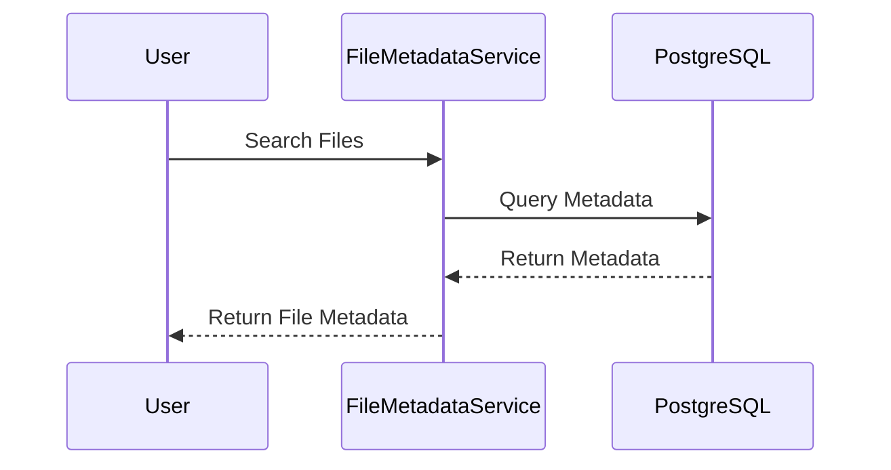

# FileManager

## Описание задачи

Написать приложение на Java, которое позволяет загружать файлы и получать их через API.  
Фронтенд не требуется, только API.
Запрос на получение списка загруженных файлов должен быть параметризуемым:
должна быть возможность получить список файлов определенного типа, больше/меньше/равно определенного размера.

**Архитектура:**

- Загрузка файлов должна обрабатываться одним сервисом.
- Анализ файлов (тип, размер) должен выполняться другим сервисом.
- Результаты анализа должны храниться в базе данных PostgreSQL.
- Сами файлы должны храниться в S3 (MinIO).
- Использовать Hibernate для взаимодействия с PostgreSQL.
- Использовать Eureka для обнаружения сервисов.

## Содержание

1. [Структура проекта](#структура-проекта)
2. [Архитектура](#архитектура)
    - [Сиквенсные диаграммы](#сиквенсные-диаграммы)
3. [Требования](#требования)
4. [Установка](#установка)
    - [Клонирование репозитория](#клонирование-репозитория)
    - [Настройка MinIO](#настройка-minio)
    - [Настройка PostgreSQL](#настройка-postgresql)
5. [Сборка проекта](#сборка-проекта)
6. [Как использовать](#как-использовать)
7. [Параметры конфигурации](#параметры-конфигурации)

## Структура проекта

Обзор структуры проекта, включая описание каждого микросервиса.

- **Eureka Server**: Реестр сервисов для микросервисов.
- **FileMetadataService**: Управляет метаданными файлов.
- **FileUploadService**: Обрабатывает загрузку файлов. Отвечает за все взаимодействия с пользователем.

## Архитектура

Проект состоит из двух основных микросервисов, каждый из которых отвечает за определенную часть процесса управления 
файлами и сервера Eureka для обнаружения сервисов:

1. **FileUploadService**
    - Получает файлы от пользователя и загружает их в MinIO.
    - Отправляет HTTP-сообщение в FileMetadataService с JSON, содержащим ссылку на файл в MinIO. Обнаруживает FileMetadataService через Eureka.
    - Если файл успешно загружен и обработан, возвращает пользователю статус 200 и сообщение об успешной загрузке.
    - Если соединение с FileMetadataService не удается, повторяет попытку до трех раз. Если это не удается, удаляет файл из MinIO и возвращает пользователю ошибку. Также отправляет запрос в FileMetadataService на удаление файла из базы данных, если он был зарегистрирован.
    - Если файл недействителен или слишком велик, возвращает пользователю ошибку. Предел размера файла контролируется параметром `file.max-size`.

2. **FileMetadataService**
    - Принимает JSON со ссылкой на файл, извлекает необходимые метаданные и записывает их в базу данных PostgreSQL вместе со ссылкой на файл.
    - Возвращает ошибку в FileUploadService, если обязательные метаданные отсутствуют.
    - Предоставляет API для возвращения списка загруженных файлов в формате JSON. Поддерживает фильтрацию файлов по размеру (больше, меньше, равно, с опциональными единицами размера, такими как байты, КБ, МБ, ГБ) и по типу.
    - Реализует проверку для обеспечения не конфликтующих условий фильтрации, таких как проверка, чтобы `min_size` не был больше `max_size`.

### Сиквенсные диаграммы

#### Успешная загрузка файла

   ```mermaid
   sequenceDiagram
       participant User
       participant FileUploadService
       participant MinIO
       participant Eureka
       participant FileMetadataService
       participant PostgreSQL
   
       User ->> FileUploadService: Upload File
       FileUploadService ->> MinIO: Store File
       alt MinIO upload failure
           MinIO -->> FileUploadService: Error Response
           FileUploadService -->> User: Error Response
       else MinIO upload success
           MinIO -->> FileUploadService: File Stored
           FileUploadService ->> Eureka: Discover FileMetadataService
           FileUploadService ->> FileMetadataService: Send File Link
           FileMetadataService ->> MinIO: Retrieve File Metadata
           MinIO -->> FileMetadataService: File Metadata
           FileMetadataService ->> PostgreSQL: Check if Metadata Exists
           alt Metadata Exists
               FileMetadataService ->> PostgreSQL: Update Metadata
               PostgreSQL -->> FileMetadataService: Metadata Updated
           else Metadata Does Not Exist
               FileMetadataService ->> PostgreSQL: Store Metadata
               PostgreSQL -->> FileMetadataService: Metadata Stored
           end
           FileMetadataService -->> FileUploadService: Metadata Stored
           FileUploadService -->> User: Success Response (200)
       end
   ```

#### Загрузка файла с ошибками

1. Ошибка MinIO

   ```mermaid
   sequenceDiagram
       participant User
       participant FileUploadService
       participant MinIO
   
       User ->> FileUploadService: Upload File
       FileUploadService ->> MinIO: Store File
       MinIO -->> FileUploadService: Error Response
       FileUploadService -->> User: Error Response
   ```

2. Загрузка с ошибкой 400 от FileMetadataService

   ```mermaid
   sequenceDiagram
       participant User
       participant FileUploadService
       participant MinIO
       participant Eureka
       participant FileMetadataService
       participant PostgreSQL
   
       User ->> FileUploadService: Upload File
       FileUploadService ->> MinIO: Store File
       MinIO -->> FileUploadService: File Stored
       FileUploadService ->> Eureka: Discover FileMetadataService
       FileUploadService ->> FileMetadataService: Send File Link
       FileMetadataService -->> FileUploadService: Error Response (400)
       FileUploadService ->> MinIO: Delete File
       FileUploadService ->> FileMetadataService: Request to Delete File Metadata
       FileMetadataService ->> PostgreSQL: Delete File Metadata
       PostgreSQL -->> FileMetadataService: Acknowledgement
       FileMetadataService -->> FileUploadService: Acknowledgement
       FileUploadService -->> User: Error Response
   ```

3. Загрузка с ошибкой 500 от FileMetadataService

   ```mermaid
   sequenceDiagram
    participant User
    participant FileUploadService
    participant MinIO
    participant Eureka
    participant FileMetadataService
    participant PostgreSQL

    User ->> FileUploadService: Upload File
    FileUploadService ->> MinIO: Store File
    MinIO -->> FileUploadService: File Stored
    FileUploadService ->> Eureka: Discover FileMetadataService
    FileUploadService ->> FileMetadataService: Send File Link
    FileMetadataService -->> FileUploadService: Error Response (500)
    alt Retry Up to 3 Times
        FileUploadService ->> FileMetadataService: Send File Link
        FileMetadataService -->> FileUploadService: Error Response (500)
    end
    FileUploadService ->> MinIO: Delete File
    FileUploadService ->> FileMetadataService: Request to Delete File Metadata
    FileMetadataService ->> PostgreSQL: Delete File Metadata
    PostgreSQL -->> FileMetadataService: Acknowledgement
    FileMetadataService -->> FileUploadService: Acknowledgement
    FileUploadService -->> User: Error Response
   ```

#### Успешное получение списка файлов



#### Получение списка файлов с ошибками

1. Запрос с невалидными фильтрами

   ```mermaid
   sequenceDiagram
    participant User
    participant FileUploadService
    participant Eureka
    participant FileMetadataService

    User ->> FileUploadService: Search Files
    FileUploadService ->> Eureka: Discover FileMetadataService
    FileUploadService ->> FileMetadataService: Search Files
    FileMetadataService -->> FileUploadService: Error Response (400)
    FileUploadService -->> User: Error Response (400)
   ```
   
2. Запрос с ошибкой базы данных
   ```mermaid
      sequenceDiagram
       participant User
       participant FileUploadService
       participant Eureka
       participant FileMetadataService
       participant PostgreSQL
   
       User ->> FileUploadService: Search Files
       FileUploadService ->> Eureka: Discover FileMetadataService
       FileUploadService ->> FileMetadataService: Search Files
       FileMetadataService ->> PostgreSQL: Query Files
       alt Response 500 or No Response from PostgreSQL
           PostgreSQL -->> FileMetadataService: Error Response (500) or No Response
           alt Retry Up to 3 Times
               FileMetadataService ->> PostgreSQL: Retry Query Files
               PostgreSQL -->> FileMetadataService: Error Response (500) or No Response
           end
           FileMetadataService -->> FileUploadService: Error Response (500)
           FileUploadService -->> User: Error Response (500)
       else Success Response
           PostgreSQL -->> FileMetadataService: Files Found
           FileMetadataService -->> FileUploadService: Files Found
           FileUploadService -->> User: Files Found Response
       end
      ```


## Требования

- Java 17
- Gradle
- MinIO (может быть запущен локально или с использованием Docker)
- PostgreSQL (может быть запущен локально или с использованием Docker)

## Установка

### Клонирование репозитория

```sh
git clone https://github.com/leanor13/FileManager.git
cd FileManager
```

### Настройка MinIO

MinIO — это высокопроизводительная система объектного хранения, совместимая с S3.

Вы можете запустить MinIO с помощью Docker или установить его напрямую.

#### Вариант 1: Запуск MinIO с помощью Docker

Запустите MinIO:

```
docker run -p 9000:9000 -p 9001:9001 --name minio \
-e "MINIO_ROOT_USER=minioadmin" \
-e "MINIO_ROOT_PASSWORD=minioadmin" \
minio/minio server /data --console-address ":9001"
```

Доступ к консоли MinIO:
Откройте браузер и перейдите по адресу [http://localhost:9001](http://localhost:9001) и войдите в систему, используя:

Имя пользователя: minioadmin  
Пароль: minioadmin  
Создайте bucket:
Создайте bucket с именем `file-storage`

#### Вариант 2: Запуск MinIO напрямую

Следуйте инструкциям по установке из официальной документации MinIO.
Создайте bucket с именем `file-storage`.

**Если вы хотите использовать другие учетные данные MinIO и/или bucket, измените соответствующие параметры в 
разделах "minio storage":**
FileMetadataService/src/main/resources/application.properties  
FileUploadService/src/main/resources/application.properties

### Настройка PostgreSQL

Вы можете запустить PostgreSQL с помощью Docker или создать базу данных локально.

Как запустить PostgreSQL с помощью Docker:
Запустите PostgreSQL:

```
docker run --name postgres \
  -e POSTGRES_PASSWORD=logic \ 
  -e POSTGRES_USER=file_user \
  -e POSTGRES_DB=file_management_db \
  -p 5433:5432 \
  -d postgres
```

**Если вы хотите использовать другую базу данных PostgreSQL, учетные данные или порты, измените соответствующие параметры в разделе "connection to the database" в:**
FileMetadataService/src/main/resources/application.properties

## Сборка проекта

Чтобы загрузить все сервисы и увидеть логи отдельно, откройте терминал для каждого сервиса и выполните следующие команды:

Терминал 1:

```
./gradlew :EurekaServer:bootRun
```

Терминал 2:

```
./gradlew :FileUploadService:bootRun
```

Терминал 3:

```
./gradlew :FileMetadataService:bootRun
```

## Как использовать

**Используйте следующие логин и пароль:**  
username: `any`  
password: `logic`  

Чтобы использовать пароль через curl:
```sh
echo -n "any:logic" | base64
```


#### Загрузка файла

Endpoint: `POST /api/files/upload`

Запрос:

```sh
curl -X POST 'http://localhost:8081/api/files/upload' \
-u <login>:<password> \
--form 'file=@"<path_to_file>"'
```

#### Получение списка загруженных файлов

Endpoint: `GET /api/files`

Параметры запроса (опционально):
- `file_type`: Фильтр по типу файла (например, `image/png`)
- `min_size`: Минимальный размер файла в запрашиваемых единицах или в единицах по умолчанию (например, `1024`)
- `max_size`: Максимальный размер файла в запрашиваемых единицах или в единицах по умолчанию (например, `2048`)
- `equal_size`: Точный размер файла в запрашиваемых единицах или в единицах по умолчанию (например, `512`)
- `size_unit`: Единица измерения размера файла (например, `bytes`, `kb`, `mb`, `gb`)
  Единица по умолчанию — `bytes`

Пример запроса:

```sh
curl -X GET "http://localhost:8081/api/files?file_type=image/png&min_size=1024&max_size=2048&size_unit=KB" \
-u <login>:<password> \
-H "accept: application/json"
```

### Примеры фильтрации

1. **Фильтрация по типу файла**
   ```sh
   curl -X GET "http://localhost:8081/api/files?file_type=image/png" \
   -u <login>:<password> \
   -H "accept: application/json"
   ```

2. **Фильтрация по минимальному размеру файла**
   ```sh
   curl -X GET "http://localhost:8081/api/files?min_size=1024" \
   -u <login>:<password> \
   -H "accept: application/json"
   ```

3. **Фильтрация по максимальному размеру файла**
   ```sh
   curl -X GET "http://localhost:8081/api/files?max_size=2048" \
   -u <login>:<password> \
   -H "accept: application/json"
   ```

4. **Фильтрация по точному размеру файла**
   ```
   curl -X GET "http://localhost:8081/api/files?equal_size=512" \
   -u <login>:<password> \
   -H "accept: application/json"
   ```

5. **Фильтрация по единицам размера файла (КБ)**
   ```
   curl -X GET "http://localhost:8081/api/files?min_size=1&max_size=250&size_unit=KB" \
   -H "accept: application/json" \
   -H "Authorization: Basic YW55OmxvZ2lj"
   ```

## Параметры конфигурации

**Используйте следующие параметры аутентификации:**

Имя пользователя: `any`
Пароль: `logic`

**FileMetadataService**

Следующие параметры используются для управления поведением FileMetadataService:

Параметры:
- `file.metadata.showUrl=true` (true/false):
  Если true, URL файла возвращается вместе с метаданными файла.
  Если false, URL в ответе будет null.
  Значение по умолчанию: `true`

- `default.size.unit=bytes` (bytes/kb/mb/gb)
  Единица измерения по умолчанию для фильтрации по размеру файла.
  Обратите внимание, что размер файла всегда возвращается в байтах.
  Значение по умолчанию: `bytes`

Эти параметры можно найти и изменить в файле:
`FileMetadataService/src/main/resources/application.properties`

**FileUploadService**

Следующие параметры используются для управления поведением FileUploadService:

Параметры:
- `file.max.size.bytes=3145728`
  Максимально допустимый размер для загрузки файлов в байтах.
  Значение по умолчанию: 3145728 (3MB)

- `send.message.retry=3`
  Количество попыток повторной отправки сообщений в FileMetadataService.
  Значение по умолчанию: 3

- `send.sleep.between.retry.ms=1000`
  Время ожидания между попытками повторной отправки, в миллисекундах.
  Значение по умолчанию: 1000

- `metadata.response.timeout.ms=5000`
  Таймаут ожидания ответа от сервиса метаданных, в миллисекундах.
  Значение по умолчанию: 5000

#### Управление параметрами конфигурации
Каждый микросервис имеет свои параметры конфигурации, определенные в их соответствующих файлах application.properties. Если вам нужно изменить поведение или лимиты сервисов, вы можете напрямую редактировать эти свойства. Этот подход позволяет гибко управлять конфигурацией каждого сервиса в соответствии с вашими конкретными потребностями.

Например, чтобы изменить максимальный размер загружаемого файла в FileUploadService, вы можете изменить свойство file.max-size:

Файл: FileUploadService/src/main/resources/application.properties

```
file.max-size=10485760
```

Это установит максимальный размер загружаемого файла в 10MB. Аналогичным образом, вы можете настроить параметры FileMetadataService для изменения единицы измерения размера по умолчанию или управления тем, отображаются ли URL-адреса в ответах с метаданными файлов.

Управляя этими свойствами, вы можете настроить поведение микросервисов так, чтобы они лучше соответствовали вашим требованиям.